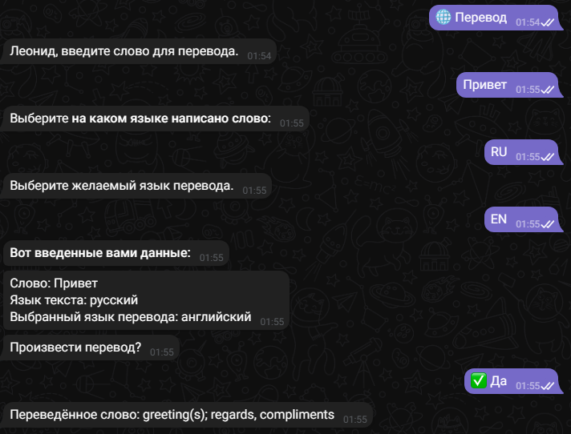

Телеграм бот созданный в качестве пет проекта. Данный бот является переводчиком по словарю с использованием стороннего API Lingvo. 

Архитектура проекта позволяет делать постоянные апдейты. Все структуировано таким образом, что можно легко добавить новые методы API и новые языки для перевода. 

(Полный список доступных языков: https://developers.lingvolive.com/ru-ru/Dictionaries)

## Основные команды:

1 `/start` - стартовое приветствие, перенаправление на команду /help

2 `/help` - описание работы бота, описание доступных языков, мои контакты, перенаправление на команду /translate 

3 `/contacts` - связь со мной

4 `/translate` - начало работы переводчика

## Основные кнопки

Кнопки для работы с ботом (вне машинного состояния)

## Командное меню

Кнопки указанные в командном меню

# Перевод

## Процесс перевода выглядит следующим образом: 

1. При осуществление команды /translate или по нажатию кнопки Перевод пользователь переходит в машинное состояние, где поэтапно ему требуется ввести необходимые данные для GET запроса.

2. Во время каждого этапа происходит проверка введенных данных, чтобы пользователь случайно (или специально) не нарушил работу программы.

3. После указания всех данных пользователю выдается вся информация, которую он отправил на сервер. Если всё устраивает он подтверждает, если нет - операция останавливается, данные сбрасываются.

4. Данные передаются в специально описанный класс ApiTranslator, который при инициализации делает POST запрос, для обновления существующего токена (сбрасывается раз в сутки).

5. Полученный токен, а так же данные в качестве параметров передаются в GET запрос на сервер, откуда мы получаем мини-карточку слова в виде json. Распаковываем и определяем результат в self.__

6. Далее в последнем машинном состоянии пользователю при помощи ранее созданного геттера на классе ApiTranslation отправляется переведенный текст. Операция завершается, данные удаляются.

# Обработка неверных данных:

## Вся обработка вынужденная, так как в случае неверно переданных параметров в GET программа перестает работать, поэтому:

1. Пользователь не может указать неверный язык, на котором написано слово.

2. Пользователь не может указать несуществующий язык.

3. Пользователь не может указать одинаковый язык слова и перевода.

4. Пользователь не может получить перевод несуществующего слова.

# На весь возможный неверный ввод пользователь будет получать сообщение, по типу: 

## Установка

1. pip install -r requirements.txt (установка необходимых библиотек)

2. python main.py (запуск бота)

# Благодарю за уделённое время. Хорошего дня.
